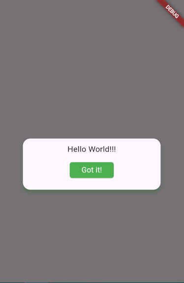

# special-alerts
This is a beautiful, easy-to-use, and responsive dialog package designed to enhance the user experience in your projects.

## <u>Examples</u>

Using **special-alerts**, in just a few lines of codes, less than 25, we can show a pretty and responsive confirmation dialogs. 

```sh
import 'package:flutter/material.dart';
import 'package:special_alerts/alerts/special_alerts.dart'; // Make sure import the special-alerts package...

void main() {
  runApp(const MaterialApp(home: MyApp()));
}

class MyApp extends StatelessWidget {
  const MyApp({super.key});

  @override
  Widget build(BuildContext context) {
  
  // This function make sure that the magic does...
    void showAlert() {
      ConfirmationDialog successDialog = const ConfirmationDialog(body: 'Hello World!!!', hideMainIcon: true); // Use ConfirmationDialog to create a beatiful dialog...
      showDialog(context: context, builder: (buildContext) => successDialog); // To make visible the dialog, you must use the showDialog function. 
    }
    return Scaffold(
        body: Center(
            child: ElevatedButton(
                onPressed: () => showAlert(),
                child: const Text('Press me!!!'))));
  }
}
```


### Types of dialog.
You can use a variates of types of dialog (success, error, warning, info or even question dialog). For example, let's create a dialog that show when a user is created. 
```sh
ConfirmationDialog successDialog = const ConfirmationDialog(body: 'The user was created successfully!',type: AlertType.success,title: 'Success'); //You need to use the type attribute to specify the type of dialog that you want to use.  
```


Or if you want to let know to the user that a problem happend:
```sh
ConfirmationDialog errorDialog = const ConfirmationDialog(title: 'Error 404',body: 'The resource was not found!',type: AlertType.error); 
```


You can use the **timer property** to set a timer to the dialog. When you use it, you must set the **duration property** too, to specify how long the dialog will be visible.
```sh
ConfirmationDialog successDialog = const ConfirmationDialog(title:'Warning',body: 'Something is missing, please check!',type: AlertType.warning,timer: true,duration: 10);
```


Also, if you want 

